  

  

<h1 align="center">👨‍💻 Hola, soy David Hernández (Dave)</h1>
<h3 align="center">Ingeniero de Software · Arquitecto Cloud y Fullstack · Tech Lead · AWS Specialist</h3>

  Soy un ingeniero de software con más de 6 años de experiencia desarrollando soluciones para el sector financiero y de pagos digitales.  
  Me apasiona crear sistemas escalables y de alto rendimiento, con un enfoque fuerte en arquitectura cloud (AWS), microservicios, calidad de código y automatización.

<ul>
  <li>🧠 Apasionado por la arquitectura serverless y el diseño de SDKs multiplataforma</li>
  <li>🚀 Foco en buenas prácticas, rendimiento, y soluciones críticas de negocio</li>
</ul>

---

## 🧳 Experiencia reciente

  
  
  

---

## 🧠 Stack Tecnológico

### 🧱 Frameworks y Librerías

### 🧰 Lenguajes

### ☁️ Cloud & DevOps

### 🗃️ Bases de Datos

### ✅ Testing y Calidad

TDD · Jest · Mocha · Chai · PyTest · Testing Library

### 🛠️ Herramientas y Entorno

Git · Visual Studio Code · WebStorm · PyCharm · Jira · GitHub · Bitbucket

### 💼 Competencias Clave

Scrum · Liderazgo técnico · Gestión de equipos · Resolución de problemas · Diseño atómico · Documentación técnica · Adaptabilidad · Comunicación interfuncional

### 🎨 Creatividad

Illustrator · Photoshop

---

## 📢 Conecta conmigo

📩 **Correo:** `david.hernandez@adelmi.io`

  

---

## 📊 GitHub Metrics

  

  

---

<h3 align="center">✨ "Construyo soluciones simples y eficientes para problemas complejos. Siempre con pasión por el detalle y el impacto." ✨</h3>
